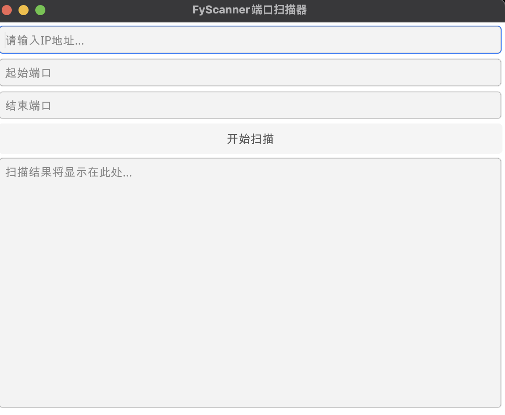
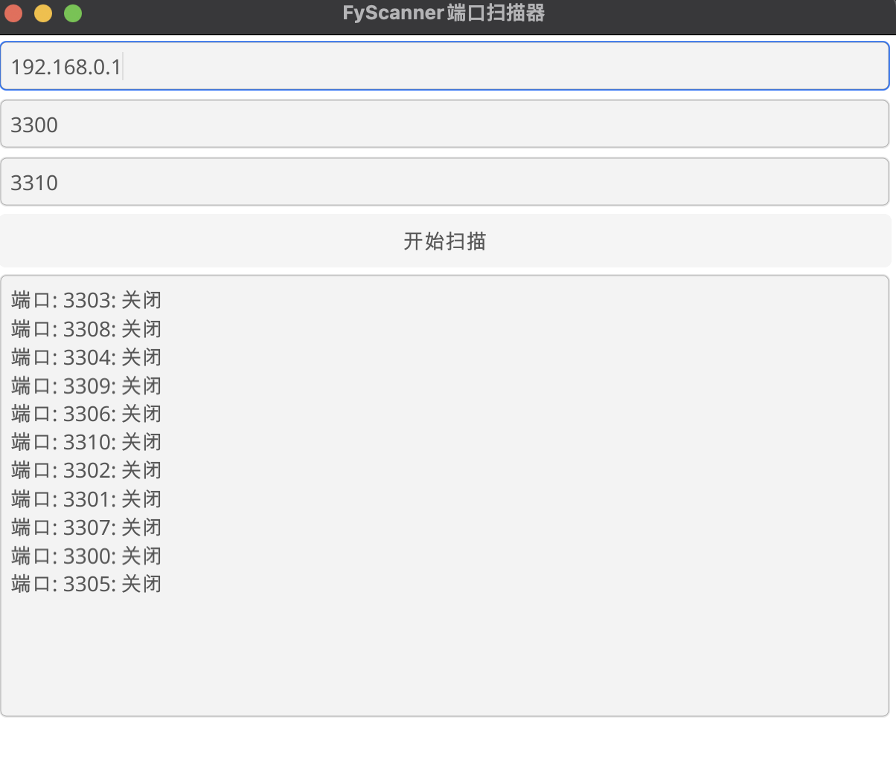

# FyScanner 端口扫描器

### 效果:



### 安装:
```shell
git clone https://github.com/mazezen/FyScanner.git
go mod tidy
go run .
```

### 打包
OS
```shell
go install fyne.io/fyne/v2/cmd/fyne@latest
fyne package -os darwin -icon ./asset/Icon.png
```
Windows
```shell
go install fyne.io/fyne/v2/cmd/fyne@latest
fyne package -os windows -icon ./asset/Icon.png
```

Linux
```shell
go install fyne.io/fyne/v2/cmd/fyne@latest
fyne package -os linux -icon ./asset/Icon.png
```
